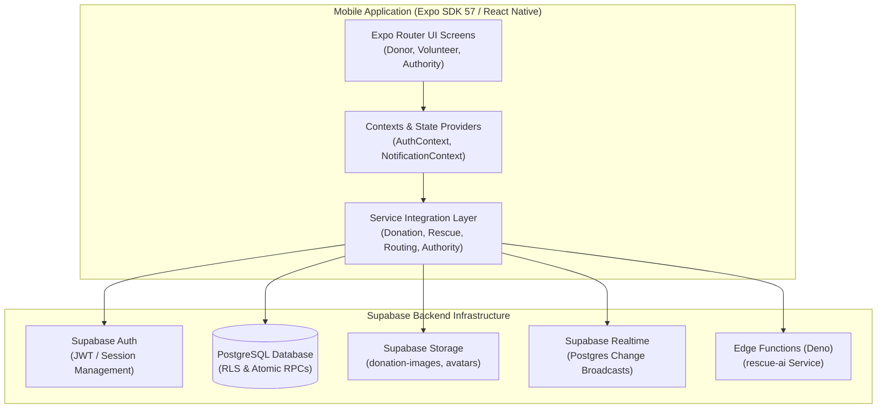
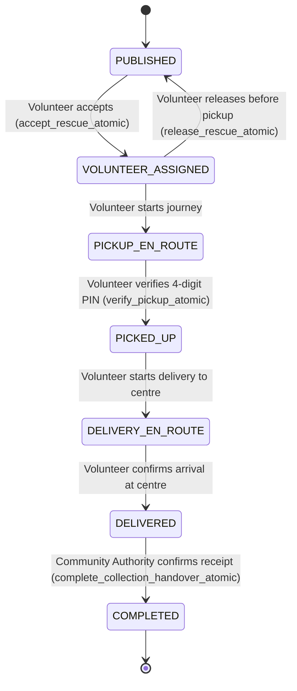

# Community Food Rescue

**IT3060 Human Computer Interaction — Group WD_18**

A mobile application designed to connect surplus-food donors, volunteer drivers and community authorities so usable food can move through a traceable donation, pickup, delivery and final handover workflow.

---

## Project Overview

The Community Food Rescue application addresses surplus-food waste by coordinating three key participant groups:

- **Donors:** Commercial food establishments, caterers, bakeries, and households with edible surplus food.
- **Volunteers:** Community drivers and riders who collect food and transport it along their journeys.
- **Community Authorities:** Local community organisations, welfare coordinators, and collection centre managers who receive and inspect food before distribution.

The application allows donors to publish available surplus food, volunteers to discover suitable rescue opportunities around their travel routes, and Community Authorities to receive and record completed food handovers at community collection centres.

The complete system combines:
- Multi-step smart donation publishing with food safety details
- Route-aware volunteer discovery with GPS and manual location fallbacks
- An atomic, state-controlled rescue lifecycle
- Secure 4-digit pickup verification
- In-transit issue reporting and audit tracking
- Realtime in-app notifications and local reminders
- Community collection centre administration
- Surplus-food aggregation and on-device PDF reporting
- Explainable AI-assisted suggestions via RescueAI

---

## Project Objectives

- **Reduce Avoidable Food Waste:** Divert wholesome surplus food from landfills to community collection centres.
- **Streamline Donor Experience:** Simplify food donation into an intuitive, progressive four-step mobile interface.
- **Improve Volunteer Discovery:** Match rescue opportunities to volunteer travel paths using detour-aware spatial calculations.
- **Traceable Custody Lifecycle:** Maintain a verifiable chain of custody from initial publication to authority receipt.
- **Build Trust Through Verification:** Eliminate lost or duplicate claims with atomic database transactions and pickup PIN verification.
- **Privacy-by-Design:** Minimise personal identifying information (PII) by avoiding collection of beneficiary personal data.
- **Empower Community Authorities:** Provide real-time incoming delivery tracking, historical audits, and category-level reporting.
- **Apply HCI Best Practices:** Deliver a cohesive, accessible, mobile-first interface developed through iterative user research.

---

## User Roles

| Role | System Representation | Main Responsibility |
| :--- | :--- | :--- |
| **Donor** | `DONOR` | Publishes surplus food, sets pickup time windows, specifies food safety constraints, and provides physical pickup verification. |
| **Volunteer** | `VOLUNTEER` | Sets travel routes, discovers matching donations, accepts missions, verifies collection at donor location, and delivers to collection centres. |
| **Community Authority** | `COORDINATOR` | Manages collection centres, monitors incoming volunteer deliveries, confirms final physical receipt, and generates surplus food summary reports. |

*Note: In the database schema and security policies, Community Authority users are represented with the role identifier `COORDINATOR`.*

---

## Core Features

### 1. Authentication & Account Management
- **Email & Password Authentication:** Standard account registration and sign-in backed by Supabase Auth (GoTrue).
- **Role Selection:** Clear role onboarding for Donors, Volunteers, and Community Authorities.
- **Demonstration Optimization:** Configured to operate reliably within university presentation settings without hitting free-tier email rate restrictions.
- **Session Persistence:** Secure credential and JWT session persistence backed by `@react-native-async-storage/async-storage`.
- **Role-Based Routing:** Automated post-login routing directly into role-specific navigation layouts (`(donor)`, `(volunteer)`, or `(coordinator)`).
- **Profile Management:** View and update profile details including full name, contact phone, and date of birth.
- **Avatar Photo Upload:** Capture or select profile photos with upload to the Supabase Storage `avatars` bucket, accompanied by automatic fallback to user initials.

### 2. Donor — Smart Donation
- **Progressive 4-Step Publishing Workflow:**
  1. *Food Info:* Food name, category selection, quantity, and unit.
  2. *Safety & Condition:* Preparation time, use-by/expiry dates, storage temperature, packaging integrity, and allergen alerts.
  3. *Pickup Window:* Pickup address, location coordinates, start time, and expiry window.
  4. *Review & Confirm:* Summary review before atomic publication.
- **Supported Food Categories:** Bakery, Prepared Meals, Rice & Curry, Vegetables, Fruit, Dairy, Packaged Food, Beverages, and Other.
- **Supported Quantity Units:** portions, packs, boxes, loaves, kg, items, and containers.
- **Storage & Packaging Constraints:** Ambient/Room Temperature, Refrigerated, Frozen, Warm/Heated; Individually Sealed, Covered Trays, etc.
- **Donation Management:** Edit active drafts, withdraw/cancel published donations, and review historical donations.
- **Pickup Verification Code:** Secure 4-digit PIN generated upon publication and revealed to the donor once a volunteer is assigned.
- **Live Status Tracking:** Realtime tracking of volunteer assignment, travel progress, and delivery completion.

### 3. Volunteer — Smart Routing & Discovery
- **Saved Journey Routes:** Configure regular travel routes (e.g., Daily Commute) with origin, destination, time windows, and maximum detour tolerance (5–30 minutes).
- **Flexible Location Provider:** Automatic device GPS coordinates with manual address fallback and geocoding.
- **Spatial Compatibility Engine:** Route matching utilizing the Haversine formula to compute detour distance between volunteer origin/destination and donor/collection points.
- **Synchronized Discovery Modes:**
  - *List View:* Sorted list of eligible rescue opportunities displaying detour time, food category, and pickup window.
  - *Map View:* Interactive map rendering origin markers, destination markers, and compatible rescue pins using `react-native-maps`.
  - Both views consume the exact same underlying database query to guarantee consistency.
- **External Navigation Integration:** One-tap linking to external turn-by-turn navigation (Google Maps and Apple Maps).

### 4. Rescue Lifecycle & Chain of Custody
The rescue lifecycle moves strictly through sequential, validated operational states:

$$\text{PUBLISHED} \longrightarrow \text{VOLUNTEER\_ASSIGNED} \longrightarrow \text{PICKUP\_EN\_ROUTE} \longrightarrow \text{PICKED\_UP} \longrightarrow \text{DELIVERY\_EN\_ROUTE} \longrightarrow \text{DELIVERED} \longrightarrow \text{COMPLETED}$$

- **PUBLISHED:** The donation is live and discoverable by volunteers.
- **VOLUNTEER_ASSIGNED:** A volunteer accepts the mission via an atomic database transaction.
- **PICKUP_EN_ROUTE:** The volunteer starts travel toward the donor pickup location.
- **PICKED_UP:** The volunteer arrives at the donor, verifies packaging/quantity, and validates the 4-digit PIN.
- **DELIVERY_EN_ROUTE:** The volunteer travels toward the designated community collection centre.
- **DELIVERED:** The volunteer arrives at the collection centre and marks the food as delivered, awaiting authority receipt.
- **COMPLETED:** The Community Authority inspects and confirms receipt, completing the mission.

### 5. Single Active Rescue Rule & Atomic Acceptance
- **Concurrency Protection:** Rescue acceptance executes via `accept_rescue_atomic`, preventing race conditions and duplicate claims on the same donation.
- **Single Active Mission Rule:** A volunteer is strictly restricted to one active in-progress mission at any time. New rescues cannot be accepted until the ongoing mission is either completed or released.
- **Cross-Layer Enforcement:** Enforced both on the client UI and validated within PostgreSQL database transactions.

### 6. Pre-Pickup Mission Release
- **Graceful Unassignment:** A volunteer who encounters unexpected delays may release an accepted mission *prior to pickup*.
- **State Restoration:** Execution of `release_rescue_atomic` restores the donation to `PUBLISHED` status so other volunteers can claim it.
- **Audit Preservation:** The previous assignment record is marked as `CANCELLED` for operational history rather than hard-deleted.
- **Post-Pickup Protection:** Mission release is strictly forbidden once food is marked as `PICKED_UP`; post-pickup disruptions must be handled via Issue Reporting.

### 7. Pickup Verification & Quantity Checking
- **4-Digit Verification PIN:** The donor provides the physical PIN upon meeting the volunteer; the volunteer inputs this PIN into the app to unlock the `PICKED_UP` transition.
- **Safety & Quality Checks:** Volunteers visually verify packaging integrity and quantity before confirming physical collection.
- **Mismatch Reporting:** Discrepancies between published and actual quantities can be recorded directly during pickup.

### 8. Volunteer Activity & Mission Tracking
- **Active Mission Tab:** Realtime view of the ongoing rescue with quick action buttons ("Start Pickup", "Verify PIN", "Start Delivery", "Confirm Delivery").
- **Completed History Tab:** Log of past completed deliveries with time stamps and locations.
- **Cancelled Missions:** Historical record of released or cancelled assignments.

### 9. Rescue Issue Reporting
- **In-Transit Issue Submission:** Volunteers and coordinators can log issues categorized by type:
  - Quantity Mismatch
  - Damaged / Spoiled Food
  - Donor Unavailable / Closed
  - Location / Access Issue
  - Packaging / Storage Compromise
- **Audit Retention:** Issues remain attached to the rescue record for transparency and administrative evaluation.

### 10. In-App Notifications & Realtime Alerts
- **Notification Feed:** In-app notification center tracking status changes (Rescue Accepted, Pickup Started, Delivery Arrived, Handover Completed).
- **Read / Unread Management:** Unread counter badges, individual mark-as-read, and mark-all-as-read actions.
- **Deep Linking:** Tapping a notification navigates directly to the relevant tracking screen or activity detail.
- **Foreground Alert Banners:** Floating banners within safe-area boundaries for instant status awareness.
- **Local Reminders:** Scheduled local reminders for upcoming pickup deadlines.

### 11. Community Authority & Collection Centre Operations
- **Operations Dashboard:** Live metrics displaying active collection centres, incoming deliveries, and completed rescues.
- **Collection Centre Management:** Full administration of community collection centres:
  - Centre name and organization details
  - Street address and latitude/longitude coordinates
  - Contact person name and phone number
  - Operating hours and access/delivery instructions
  - Active / Inactive status toggle (soft deactivation ensures historical deliveries remain intact)
- **Incoming Delivery Feed:** Real-time visibility into volunteer couriers currently en route or waiting at the centre.
- **Final Handover Confirmation:** Atomic confirmation (`complete_collection_handover_atomic`) transitioning delivered donations into `COMPLETED`.

### 12. Surplus Food Summary & On-Device PDF Reporting
- **Strict Data Scope:** Summaries strictly evaluate only `COMPLETED` food rescues to prevent speculative or unfulfilled data.
- **Flexible Time Period Filtering:** Today, Last 7 Days, Last 30 Days, All Time, or Custom Date Ranges.
- **Multi-Unit Aggregation:** Calculates totals grouped by Category and Unit (e.g., 25 portions of Prepared Meals, 8 items of Bakery, 15 kg of Vegetables). Incompatible units are never falsely merged into meaningless totals.
- **Client-Side PDF Generation:** Converts the filtered summary directly into a formatted PDF document using `expo-print`.
- **System Share Sheet:** Integrated with `expo-sharing` to allow instant saving, printing, or sending via native system dialogs.
- **Privacy Preservation:** Generated reports aggregate quantities and categories only, containing zero beneficiary personal identifying information.

---

## RescueAI Engine

RescueAI is an advisory intelligent assistance service designed to assist donors and volunteers with structured heuristics and optional machine-learning suggestions.

```
Mobile Application (Client)
        │
        ├── Standard Operations ──► Supabase PostgreSQL (Auth / RLS / RPC)
        │
        └── Advisory AI Request ──► Supabase Edge Function (rescue-ai / Deno)
                                           │
                                           ├── External AI Model (When configured)
                                           └── Deterministic Heuristic Fallback
```

### Core Capabilities
- **Photo Category Suggestion:** Analyzes food images to recommend the most suitable food category and unit.
- **Urgency Scoring:** Evaluates food category, preparation time, and storage conditions to suggest appropriate pickup windows.
- **Route Compatibility Ranking:** Scores detour compatibility between volunteer routes and pending rescues.
- **Deterministic Fallback Engine:** If external AI services are unconfigured, unreachable, or encounter rate limits, the system seamlessly falls back to pre-defined deterministic heuristic rules.

### Safety & Governance Boundaries
- **Advisory Only:** RescueAI provides recommendations; it never executes mutations or overrides human confirmation.
- **Strict Architectural Separation:** AI logic cannot bypass PostgreSQL Row Level Security (RLS) or atomic RPC state machines.
- **No Food Safety Certification:** RescueAI does not claim legal food safety certification; physical inspections remain with donors, volunteers, and authority personnel.

---

## Technology Stack

| Layer | Technology | Version / Specification | Purpose |
| :--- | :--- | :--- | :--- |
| **Mobile Framework** | React Native | 0.86.3 | Cross-platform native mobile application |
| **Runtime & Tooling** | Expo SDK | SDK 57 (v57.0.27) | Managed mobile development framework and libraries |
| **Language** | TypeScript | ~6.0.3 | Strict end-to-end type safety |
| **Navigation** | Expo Router | ~57.0.25 | File-based typed screen routing and navigation |
| **Backend & Database** | Supabase / PostgreSQL | PostgreSQL 15+ (PostgREST 14.18) | Relational database, security policies, and RPC |
| **Authentication** | Supabase Auth | GoTrue | User authentication and JWT session management |
| **File Storage** | Supabase Storage | S3-Compatible Buckets | Donation imagery and user profile avatars |
| **Realtime Engine** | Supabase Realtime | WebSocket Channels | Live updates for donations, rescues, and notifications |
| **Serverless Functions**| Supabase Edge Functions| Deno Runtime | Isolated execution environment for RescueAI |
| **Mapping & Location** | react-native-maps | 1.27.2 | In-app map rendering, markers, and route display |
| **Location Services** | expo-location | ~57.0.20 | Device GPS coordinates and reverse geocoding |
| **PDF Generation** | expo-print | ~57.0.2 | Local HTML-to-PDF compilation on mobile |
| **Native Sharing** | expo-sharing | ~57.0.22 | Native system share sheet integration |
| **Local Persistence** | AsyncStorage | 2.2.0 | Device-side session caching |
| **UI Components** | Custom Design System | Vanilla React Native StyleSheet | Mobile-first light theme with glassmorphic styling |

---

## System Architecture



---

## Core Database Entities

| Table Name | Description |
| :--- | :--- |
| `profiles` | User profile details, full name, contact phone, date of birth, role (`DONOR`, `VOLUNTEER`, `COORDINATOR`), and avatar URL. |
| `donations` | Published food donations, food details, quantities, safety info, pickup coordinates, verification PIN, and current status. |
| `volunteer_routes` | Saved and active volunteer travel routes, origin/destination coordinates, schedule, and max detour tolerances. |
| `rescue_assignments`| Traceable records linking a volunteer to a donation, tracking timestamped lifecycle milestones from assignment to completion. |
| `community_points` | Community collection centres managed by authorities, including address, contact information, operating hours, and active status. |
| `rescue_issues` | Issues reported during pickup, transit, or handover (e.g., damaged items, quantity discrepancies, access issues). |
| `clarification_requests`| Operational inquiries exchanged between coordinators and donors regarding donation specifics. |
| `notifications` | In-app notification records with priority levels, resource links, and read/unread status. |
| `devices` | Registered device push tokens and platform metadata for notification routing. |
| `organizations` | Registered welfare organizations and charities affiliated with community collection centres. |
| `organization_members`| Membership mapping associating coordinators with specific organizations. |
| `distribution_records`| Internal authority records tracking downstream distribution batches from collection hubs. |
| `rescue_ai_insights` | Audit cache storing explainable reasoning summaries generated by RescueAI. |
| `rescue_ai_matches` | Scoring logs assessing match confidence between donations and registered routes. |
| `reservations` | Temporary coordinator reservations for targeted bulk donation pickups. |

---

## File Storage Buckets

Supabase Storage is structured into two dedicated public buckets configured with strict RLS upload policies:

| Bucket Name | Purpose | Object Path Structure |
| :--- | :--- | :--- |
| `donation-images` | High-resolution photographs of surplus food donations. | `${userId}/${donationId}_${timestamp}.${ext}` |
| `avatars` | Profile pictures for donors, volunteers, and authority coordinators. | `${userId}/avatar_${timestamp}.${ext}` |

- Uploaded images are referenced via public CDN URLs stored directly in the respective database rows.
- If storage services are temporarily unreachable, safe client-side fallbacks (such as user initials for avatars) ensure seamless user experience.

---

## Realtime Subscriptions

The mobile application establishes targeted Realtime WebSocket channels to reflect live state changes without manual polling:

- `subscribeToDonorDonations`: Live updates for donors tracking assignment and delivery milestones.
- `subscribeToDonation`: Single-donation status synchronization for active tracking screens.
- `subscribeToDiscoverableDonations`: Real-time updates to the volunteer discovery pool when donations are published or claimed.
- `subscribeToActiveRescue`: Live synchronization of volunteer active mission state.
- `subscribeToVolunteerAssignments`: Activity history and milestone timestamp updates.
- `subscribeToCoordinatorIncoming`: Real-time notification of incoming couriers for community authorities.
- `subscribeToCoordinatorHistory`: Immediate display of recently completed handovers in authority logs.
- `subscribeToUserNotifications`: Real-time delivery of notifications and badge counter increments.
- `subscribeToActiveCommunityPoints`: Instant reflection of newly created or edited collection centres.
- `subscribeToDonationIssues`: Visibility into newly raised operational issues.

---

## Atomic Rescue Operations (PostgreSQL RPC)

To ensure transaction safety, eliminate race conditions, and protect the state machine, critical transitions execute via PostgreSQL `SECURITY DEFINER` stored procedures:

| Stored Procedure (RPC) | Operational Purpose | Concurrency Protection |
| :--- | :--- | :--- |
| `accept_rescue_atomic` | Assigns an eligible volunteer to a `PUBLISHED` donation. | Verifies single active rescue rule; performs row-level locking on `donations` to prevent double-claiming. |
| `release_rescue_atomic` | Releases an uncollected assignment before pickup. | Reverts donation to `PUBLISHED`; sets assignment to `CANCELLED`; rejects execution if already `PICKED_UP`. |
| `start_pickup_atomic` | Transitions mission status to `PICKUP_EN_ROUTE`. | Validates assigned volunteer identity and active status. |
| `verify_pickup_atomic` | Validates donor 4-digit PIN and confirms food collection. | Validates PIN match; verifies quantities; updates status to `PICKED_UP`. |
| `start_delivery_atomic` | Transitions mission status to `DELIVERY_EN_ROUTE`. | Ensures valid pickup before delivery transit begins. |
| `verify_delivery_atomic` | Marks food arrival at collection centre as `DELIVERED`. | Transitions state to awaiting authority receipt. |
| `complete_collection_handover_atomic` | Confirms final physical handover by Community Authority. | Validates coordinator authorization; sets both donation and assignment to `COMPLETED`. |
| `acknowledge_delivery_atomic` | Records authority acknowledgement of delivered items. | Idempotent status check preventing duplicate confirmations. |
| `reserve_donation_atomic` | Reserves food for direct authority collection. | Locks donation row against concurrent volunteer claims. |
| `update_my_profile_details` | Securely updates user profile name, phone, DOB, and avatar. | Enforces self-ownership; prevents unauthorized privilege escalation. |

---

## Security & Privacy

- **Row Level Security (RLS):** Every database table is protected by PostgreSQL RLS policies ensuring users can only read or modify data according to their authenticated role.
- **Role Verification:** Critical management actions verify user role membership in `profiles` before executing state mutations.
- **Client Key Isolation:** Only the public Supabase Anon key is bundled in the mobile application. The `service_role` key is strictly prohibited and never included in client code.
- **PIN Verification:** Physical handovers require out-of-band verification via a donor-held 4-digit PIN, preventing false pickup claims.
- **Privacy by Design:** The system intentionally avoids collecting beneficiary personal identifying information (PII). Reports and summaries aggregate items and categories without individual recipient records.
- **Audit Trails:** Critical events (assignment, pickup, delivery, issues, and completion) record immutable UTC timestamps and actor references.

---

## Rescue State Machine



*Note: If an assigned volunteer releases a mission before pickup, the donation returns to `PUBLISHED` while the existing assignment record is transitioned to `CANCELLED` to preserve historical integrity.*

---

## Route Matching & Maps

- **Haversine Distance Logic:** Calculates exact great-circle distance between coordinates for local detour calculations without requiring third-party routing billing.
- **Detour Tolerance:** Matches donations where the pickup detour falls within the volunteer's configured detour threshold (5 to 30 minutes).
- **Coordinate Precision:** Coordinates are validated to ensure valid geographic latitude (`-90` to `+90`) and longitude (`-180` to `+180`).
- **Map Visualizations:** Uses `react-native-maps` to render origin, destination, and donation markers with color-coded status badges.
- **Synchronized Data Pipeline:** The list view and map view receive the exact same filtered dataset, ensuring seamless consistency when switching views.

---

## UI/UX Design System

- **Mobile-First Paradigm:** Built specifically for one-handed mobile interaction with touch-friendly targets (at least 44 pt).
- **Color Palette:** A cohesive, accessible emerald-green brand palette (`#1B5E20` to `#2E7D32`) symbolizing freshness and sustainability, paired with high-contrast text tokens.
- **Glassmorphism Styling:** Lightweight semi-transparent surface cards with subtle border treatments and backdrop blur.
- **Progressive Disclosure:** Multi-step stepper components reduce cognitive load during complex flows such as donation publishing.
- **Defensive Confirmation:** Destructive or significant lifecycle actions (e.g., releasing a rescue, completing handover) require explicit confirmation dialogs.
- **Safe Area Adaptability:** Designed with `react-native-safe-area-context` to accommodate camera notches, dynamic islands, and home indicator bars across iOS and Android.

---

## Repository Structure

```
y3s2-hci-community-food-rescue-app/
├── app/                               # Expo Router file-based screens and routes
│   ├── (auth)/                        # Authentication screens (Login, Register, Role Selection)
│   ├── (donor)/                       # Donor portal (Dashboard, Donate, My Donations, Profile)
│   ├── (volunteer)/                   # Volunteer portal (Discover List/Map, Routes, Activity)
│   └── (coordinator)/                 # Authority portal (Dashboard, Centres, Incoming, Reports)
├── src/                               # Modular application source code
│   ├── components/                    # Reusable UI widgets, cards, steppers, and map views
│   │   ├── ui/                        # Design system primitives (buttons, cards, badges)
│   │   ├── profile/                   # Profile editing and avatar controls
│   │   ├── rescue/                    # Rescue cards, status badges, and PIN inputs
│   │   └── maps/                      # Map markers, route polylines, and map wrappers
│   ├── contexts/                      # React Context providers (AuthContext, ThemeContext)
│   ├── services/                      # Business logic, Supabase queries, and RPC callers
│   │   ├── auth/                      # Authentication service
│   │   ├── donations/                 # Donation CRUD, validation, and status tracking
│   │   ├── routes/                    # Route persistence and matching engine
│   │   ├── rescue/                    # Rescue lifecycle, PIN verification, and issues
│   │   ├── notifications/             # Notification feed and realtime handlers
│   │   ├── coordinator/               # Collection centre management and food summaries
│   │   └── storage/                   # Image and avatar upload services
│   ├── hooks/                         # Shared custom hooks (useLocation, useDebounce)
│   ├── utils/                         # Date formatters, string helpers, and sanitizers
│   ├── constants/                     # Design tokens, color palettes, and layout spacing
│   ├── types/                         # TypeScript interfaces and Supabase generated types
│   └── lib/                           # External client initializations
├── assets/                            # Static imagery, icons, and splash screens
│   ├── images/                        # Illustration assets and onboarding graphics
│   └── icons/                         # Application launcher icons
├── supabase/                          # Backend database configuration
│   ├── migrations/                    # Ordered SQL migration scripts
│   └── functions/                     # Supabase Edge Functions
│       └── rescue-ai/                 # RescueAI Deno serverless function
├── tests/                             # Automated test suites and verification runners
│   └── runStandalone.cjs              # Comprehensive test runner (212 test cases)
└── README.md                          # Repository documentation
```

---

## Git Branch Strategy

The project employs a structured Git flow separating development, integration, and release branches:

```
feature/leader-smart-donation ──┐
feature/smart-routing ──────────┼──► dev (Integration) ──► Validation ──► main (Release)
feature/rescue-notifications ───┤
feature/coordinator-trust ──────┘
```

- **`main`:** Production-ready, stable release branch.
- **`dev`:** Core integration branch where all feature modules are merged and verified.
- **`feature/leader-smart-donation`:** Shared authentication, core design system, Smart Donation publishing, donor profile, and RescueAI integration.
- **`feature/smart-routing`:** Volunteer travel routes, GPS/manual location handling, spatial matching, and Map/List discovery.
- **`feature/rescue-notifications`:** Volunteer rescue lifecycle execution, Activity tracking, PIN verification, issue logging, mission release, and in-app notifications.
- **`feature/coordinator-trust`:** Community Authority dashboard, collection centre administration, incoming delivery tracking, final handover confirmation, and PDF food summary reports.

---

## Team & Contributions

| Student ID | Member Name | Role & Allocation | Primary Responsibilities |
| :--- | :--- | :--- | :--- |
| **IT23817708** | Kumara M.D.Y | Group Leader (28%) | Shared Auth/Core UI, Smart Donation System, Donor Profile, RescueAI Edge Function, system stability, and final integration. |
| **IT23822580** | Premarathna A.A.D.H.K | Member 2 (24%) | Smart Routing, volunteer travel route management, GPS/location services, spatial detour matching, and Map/List discovery. |
| **IT23821590** | Hewage H.W.A.I | Member 3 (24%) | Volunteer rescue lifecycle execution, Activity tracking, mission release, pickup PIN verification, delivery workflow, issue reporting, and in-app notifications. |
| **IT23823266** | Herath H.M.D.D | Member 4 (24%) | Community Authority operations, collection centre administration, incoming delivery tracking, atomic handover confirmation, history, and PDF surplus-food reporting. |

---

## Environment Configuration

Configure project environment variables by creating a `.env` file in the project root based on `.env.example`:

```bash
# Supabase Configuration (Required)
EXPO_PUBLIC_SUPABASE_URL=https://your-project-id.supabase.co
EXPO_PUBLIC_SUPABASE_PUBLISHABLE_KEY=your-publishable-anon-key

# Optional Maps Configuration
EXPO_PUBLIC_GOOGLE_MAPS_API_KEY=your-google-maps-api-key
```

> **Security Note:** Only `EXPO_PUBLIC_` environment variables intended for client use are included in the mobile bundle. Server-side secrets (such as AI provider API keys or service role keys) are configured exclusively inside the Supabase Edge Function environment via `supabase secrets set`.

---

## Installation & Running Locally

### Prerequisites
- Node.js (v18.x or v20.x recommended)
- npm or bun
- Expo Go app on iOS/Android or an active mobile simulator

### Setup Steps
1. Clone the repository:
   ```bash
   git clone https://github.com/yasith-git/y3s2-hci-community-food-rescue-app.git
   cd y3s2-hci-community-food-rescue-app
   ```
2. Install dependencies:
   ```bash
   npm install
   ```
3. Configure environment variables:
   ```bash
   cp .env.example .env
   # Edit .env with your valid Supabase project credentials
   ```
4. Start the Expo development server:
   ```bash
   npx expo start
   ```
5. Run on your target platform:
   - Scan the QR code using the **Expo Go** app on your physical mobile device.
   - Press `a` in the terminal to launch the Android Emulator.
   - Press `i` in the terminal to launch the iOS Simulator.
   - Press `w` in the terminal to launch in a web browser.

---

## Supabase Backend Setup

To configure a new Supabase backend instance for the application:

1. **Create Project:** Provision a new PostgreSQL project on [Supabase](https://supabase.com).
2. **Apply Migrations:** Execute the SQL migration files located in `supabase/migrations/` in chronological order to initialize tables, RLS policies, and atomic RPC functions.
3. **Provision Storage Buckets:**
   - Create public bucket `donation-images`.
   - Create public bucket `avatars`.
   - Apply the corresponding Storage RLS access policies.
4. **Deploy RescueAI Function (Optional):**
   ```bash
   supabase functions deploy rescue-ai
   ```
5. **Configure Secrets:** Set any external AI provider keys in Supabase if live model inference is desired.
6. **Connect Mobile Client:** Update your local `.env` file with the project URL and Anon key.

---

## Testing & Verification

The project includes comprehensive test suites and automated static verification:

- **Automated Test Suite:** **212 / 212 tests passed** across 11 comprehensive test suites:
  - *Suite 1:* Auth & Profile Validation Rules
  - *Suite 2:* State Machine & Full Lifecycle Transitions
  - *Suite 3:* RescueAI Explainable Engines & Matching
  - *Suite 4:* Beneficiary Distribution Traceability & Privacy
  - *Suite 5:* Community Authority Collection Centres & Handover Operations
  - *Suite 6:* Volunteer Accept $\rightarrow$ Activity $\rightarrow$ Sequential Rescue Flow
  - *Suite 7:* Volunteer Delivery $\rightarrow$ Authority Handover $\rightarrow$ Completion Sync
  - *Suite 8:* Notification Lifecycle & In-App Realtime System
  - *Suite 9:* Community Collection Centre CRUD & Schema Alignment
  - *Suite 10:* Donor & Volunteer Profile Details & Photo Update
  - *Suite 11:* Authority Surplus Food Category Summary & PDF Report
- **TypeScript Static Check:** **0 errors** (`npx tsc --noEmit`).
- **Expo Doctor:** **21 / 21 project diagnostics passed** (`npx expo-doctor`).
- **Edge Function Verification:** **0 errors** in Deno runtime static check.

To execute the test suite:
```bash
npm test
```

To run TypeScript verification:
```bash
npx tsc --noEmit
```

---

## Key Verified Flows

The following end-to-end workflows have been tested and verified on physical devices:
1. **Donor Onboarding & Publishing:** Account creation, profile photo upload, progressive 4-step donation creation, photo upload, and instant publication.
2. **Volunteer Discovery & Matching:** Route configuration, location calculation, synchronized List and Map view updates.
3. **Atomic Rescue Acceptance:** Single active rescue enforcement, race-condition rejection, and activity dashboard population.
4. **Pre-Pickup Mission Release:** Smooth cancellation prior to pickup, immediate restoration to the discovery pool, and assignment audit logging.
5. **Physical Pickup Verification:** 4-digit PIN verification between donor and volunteer, quantity checking, and packaging inspection.
6. **Delivery & Authority Handover:** In-transit tracking, arrival marking, authority inspection, and atomic completion synchronization.
7. **Authority Operations & Reporting:** Creation/editing/deactivation of collection centres, incoming queue monitoring, and on-device PDF generation with system sharing.

---

## Demonstration Notes

- **Academic Demonstration Scope:** This application is developed as an academic project for educational evaluation and demonstration purposes.
- **Demo Authentication Configuration:** To avoid hitting free-tier Supabase email dispatch limits during live presentations, authentication flows are optimized for immediate session establishment.
- **In-App Realtime Notifications:** The system provides full in-app realtime notifications and local reminder support; production-scale remote APNs/FCM push notifications would require paid Apple Developer and Google Firebase cloud messaging infrastructure.
- **Deterministic AI Fallback:** RescueAI is designed with robust heuristic fallback logic so core app workflows function reliably even when offline or without external AI credits.

---

## Future Improvements

- **Production Push Infrastructure:** Configuration of native APNs and FCM delivery channels with background message handlers via EAS Build.
- **Advanced Route Multi-Stop Optimization:** Multi-waypoint traveling salesperson routing for volunteers collecting multiple small donations.
- **Enhanced Accessibility:** Integration of screen-reader audio announcements and dynamic font scaling.
- **Multilingual Support:** Localization into Sinhala and Tamil alongside English.
- **Community Analytics Dashboard:** Extended web portal for municipal authorities to evaluate regional food rescue metrics over time.

---

## Academic Project Notice

This project was developed by **Group WD_18** for the **IT3060 Human Computer Interaction** module at the Sri Lanka Institute of Information Technology (SLIIT).

It is intended strictly for academic evaluation and demonstration. Any real-world deployment would require additional operational, legal, security, and food-safety reviews.
